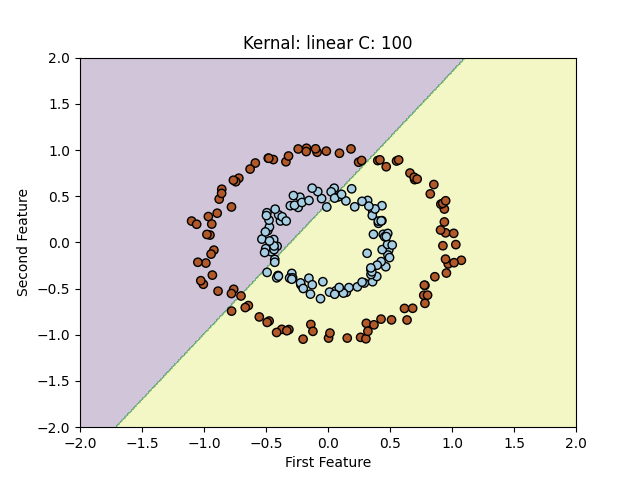
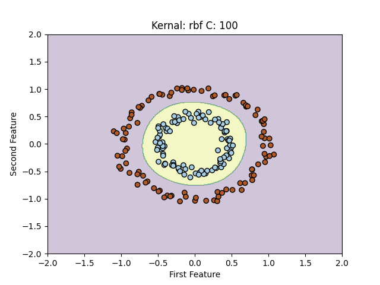

# SVM Kernel Analysis and Data Preprocessing Pipeline

Conducted a comprehensive analysis of Support Vector Machine (SVM) kernels to understand their performance on non-linear datasets, while ensuring methodological rigor through a properly structured cross-validation and preprocessing pipeline.


---

## 🎯 Project Overview

This project focuses on two core machine learning concepts using `scikit-learn` and Support Vector Machines (SVMs):

1.  **Part 1 (`svm_dataset1.py`): The Kernel Trick**
    * Demonstrates *why* different kernels are necessary by applying `Linear`, `Polynomial`, and `RBF` kernels to a non-linearly separable "circles" dataset.
2.  **Part 2 (`svm_dataset2.py`): The Preprocessing Pipeline**
    * Implements a methodologically sound pipeline using `GridSearchCV` that integrates `StandardScaler` (for feature scaling) *inside* the cross-validation loop to prevent data leakage and find the optimal hyperparameters.

---

## 🔬 Part 1: Visualizing the Kernel Trick

This experiment uses a synthetic "circles" dataset where one class is nested inside the other. A simple linear classifier cannot solve this.

### The Problem: Linear Kernel
A standard SVM with a linear kernel attempts to find the "best" straight line (or hyperplane) to separate the two classes. On this dataset, it fails, resulting in high misclassification.



### The Solution: RBF Kernel
The **Radial Basis Function (RBF) kernel** works by projecting the 2D data into a higher-dimensional space where a linear separator *can* be found. When projected back to 2D, this separator becomes a complex, non-linear decision boundary. As shown in the plot, the RBF kernel perfectly separates the two circles.



---

## 🛠️ Part 2: The Preprocessing & CV Pipeline

This experiment demonstrates the *correct* way to perform hyperparameter tuning on a dataset that requires preprocessing.

### The Data Leakage Problem
A common mistake is to scale the *entire* dataset *before* cross-validation. This leaks statistical information from the validation/test folds into the training folds, making the model's performance appear artificially high.

### The Correct Pipeline
To prevent data leakage, a `scikit-learn` **`Pipeline`** was constructed. This pipeline bundles the `StandardScaler` and the `SVC` (SVM Classifier) into a single object.

This `Pipeline` object is then passed to `GridSearchCV`. `GridSearchCV` handles the cross-validation, and at each step, it *only* fits the `StandardScaler` on the training fold for that specific split. The validation fold is then transformed using this *already-fit* scaler, simulating a realistic, unbiased test.

**Example Pipeline Logic:**
```python
# 1. Define the preprocessing and model steps
pipeline = Pipeline([
    ('scaler', StandardScaler()),
    ('svm', SVC())
])

# 2. Define the hyperparameter grid to search
# (Note: 'svm__C' syntax accesses parameters of the 'svm' step in the pipeline)
param_grid = {
    'svm__kernel': ['linear', 'rbf', 'poly'],
    'svm__C': [0.01, 1, 100]
}

# 3. Set up the grid search with cross-validation
grid_search = GridSearchCV(pipeline, param_grid, cv=10, scoring='accuracy')

# 4. Run the search
grid_search.fit(X_train, y_train)
```

### Results
On the second dataset, this rigorous pipeline correctly identified the optimal configuration as **`Linear kernel`** with **`C=100`**, achieving the best-tuned, unbiased accuracy.

---

## 🚀 How to Run

### Prerequisites
* Python 3
* `scikit-learn` (`pip install scikit-learn`)
* `numpy` (`pip install numpy`)
* `matplotlib` (`pip install matplotlib`)

### 1. Run Kernel Analysis (Dataset 1)
This script will train the SVMs on the "circles" dataset and save the resulting plots to the `figs/` directory.

```bash
python svm_dataset1.py
```

### 2. Run Preprocessing Pipeline (Dataset 2)
This script will load the second dataset, run the full `GridSearchCV` with the embedded preprocessing pipeline, and print the best-performing hyperparameters and the final test score.

```bash
python svm_dataset2.py
```